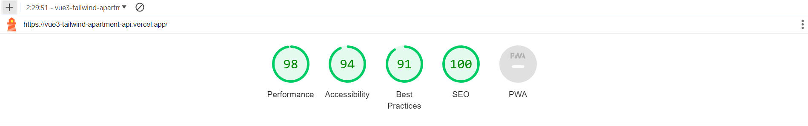

# Minty Host - Technical Test

<br>

<p align="center">
  
</p>

<br>

**DEPLOY**:
<br>
https://minty-host-technical-test.vercel.app/

<br>
<br>

# Index

1. [Project Title and Deployment link](#minty-host---technical-test)

2. [Features](#features)

3. [Technologies and Tools used](#technologies-and-tools-used)

4. [Project Setup](#project-setup)

5. [Lighthouse results](#lighthouse-results)

6. [Project status](#project-status)

7. [Contribution](#contribution)

8. [Project developer](#project-developer)

<br>
<br>

## Features

<div>

    ✔️ Responsive Navbar. In reduced size, the component's functionality changes to display a "hamburger" menu, revealing the same options.

    ✔️ Language Selector (ES / EN).

    ✔️ Dynamically obtained "List" of apartments from the provided API.

    ✔️ "Card" component displaying detailed information for each apartment. It includes:
      - Image carousel with arrows for navigation.
      - Description of the apartment and neighborhood.
      - Maximum guest capacity.
      - Province of location.
      - Availability indicators for services (wifi, A/C, and/or heating).
      - Number of bedrooms and bathrooms.
      - Square meters.
      - Monthly price.
      - Button to check availability.

    ✔️ Responsive design.

</div>

<br>

## Technologies and Tools used

<div align="center">
  <br>
  <a href="https://vuejs.org/" target="_blank" rel="noreferrer"> </a>
  <a href="https://tailwindcss.com/" target="_blank" rel="noreferrer"> </a>
  <a href="https://developer.mozilla.org/en-US/docs/Web/JavaScript" target="_blank" rel="noreferrer"> </a>
  <br>
  <br>
  <a href="https://developer.mozilla.org/en-US/docs/Glossary/HTML5" target="_blank" rel="noreferrer"> </a>
  <a href="https://developer.mozilla.org/en-US/docs/Web/CSS" target="_blank" rel="noreferrer"> </a>
  <a href="https://sweetalert2.github.io/" target="_blank" rel="noreferrer"> </a>
  <br>
  <br>
  <a href="https://eslint.org/" target="_blank" rel="noreferrer"> </a>
   <a href="https://prettier.io/" target="_blank" rel="noreferrer"> </a>
  <a href="https://developer.chrome.com/docs/lighthouse/overview/" target="_blank" rel="noreferrer"> </a>
  <a href="https://vitejs.dev/" target="_blank" rel="noreferrer"> </a>
  <a href="https://vercel.com/" target="_blank" rel="noreferrer"> </a>
</div>

<br>

## Project Setup

This template should help get you started developing with Vue 3 in Vite.

## Recommended IDE Setup

[VSCode](https://code.visualstudio.com/) + [Volar](https://marketplace.visualstudio.com/items?itemName=Vue.volar) (and disable Vetur) + [TypeScript Vue Plugin (Volar)](https://marketplace.visualstudio.com/items?itemName=Vue.vscode-typescript-vue-plugin).

## Customize configuration

See [Vite Configuration Reference](https://vitejs.dev/config/).

## Project Setup

```sh
npm install
```

### Compile and Hot-Reload for Development

```sh
npm run dev
```

### Compile and Minify for Production

```sh
npm run build
```

### Lint with [ESLint](https://eslint.org/)

```sh
npm run lint
```

<br>

## Lighthouse results

<p align="center">
  
</p>

<br>

## Project status

<br>


<br>

## Contribution

If you want to contribute to this project, follow these steps:

1. Perform a fork to the repository.

2. Create a branch for your feature or bugfix: `git checkout -b feature/your-feature-name`

3. Make the necessary changes and commits:  `git commit -m 'Add some feature'`

4. Push to branch: `git push origin feature/your-feature-name`

5. Send a pull request to the original repository.

<br>

## Project developer

<br>

| [<br><sub>Kevin Schans</sub>](https://github.com/KevinVanDerSchans) |
:------------------------------------------------------------------------------------------------------------------------------------------: |
